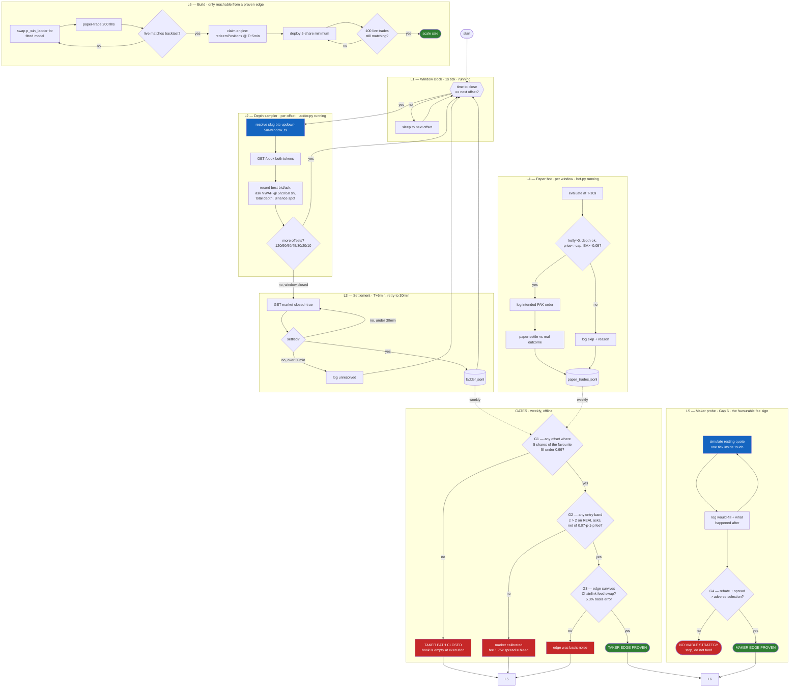

# LOOPS.md — Execution Graph

Nine loops. Three run continuously, four are gates, two are build loops that only
open if a gate passes. Gates are the point: each one can close the project.

See [ROADMAP_V2.md](ROADMAP_V2.md) for the evidence behind each gate.

---

## Master graph

---

## Loop table

| # | Loop | Period | Blocking | Status | Output |
|---|---|---|---|---|---|
| L1 | Window clock | 1s / offset | no | running | — |
| L2 | Depth sampler | 7× per window | **yes** | running | `ladder.jsonl` |
| L3 | Settlement | T+6min, retry→30min | no | running | resolved rows |
| L4 | Paper bot | per window | no | running | `paper_trades.jsonl` |
| L5 | Maker probe | per window | **yes** | running | `maker_probe.jsonl` |
| L6 | Build | on demand | no | gated | — |
| G1 | Fill gate | weekly | **yes** | pending data | open/closed |
| G2 | Calibration gate | weekly | **yes** | pending G1 | z-scores |
| G3 | Feed gate | weekly | **yes** | pending G2 | basis-adjusted |
| G4 | Maker gate | weekly | **yes** | pending L5 | fill vs adverse |

Critical path: **L2 → G1 → G2 → G3 → L6**, with **L5 → G4 → L6** as the parallel and
currently more promising branch.

---

## Rejected loops

Do not build these. Each was tested and failed.

| Loop | Why rejected |
|---|---|
| Micro-hedge / tail bet | −14.30% ROI over 700 windows; tail priced fair at z=−0.03; fee is 6.8% of notional |
| Ladder-gated EV snipe | Scaffold's own logic: 31% hit, −$0.064/trade. The EV filter selects its own worst trades |
| 0.88 price cap | Worst of four bands (−0.70% ROI); skips 50% of windows |
| Multi-RPC in trade path | CLOB orders are signed off-chain and POSTed over HTTP. RPC is not in the trade path |
| T+30s claim loop | Settlement is ~4.6 min. Fires into nothing |
