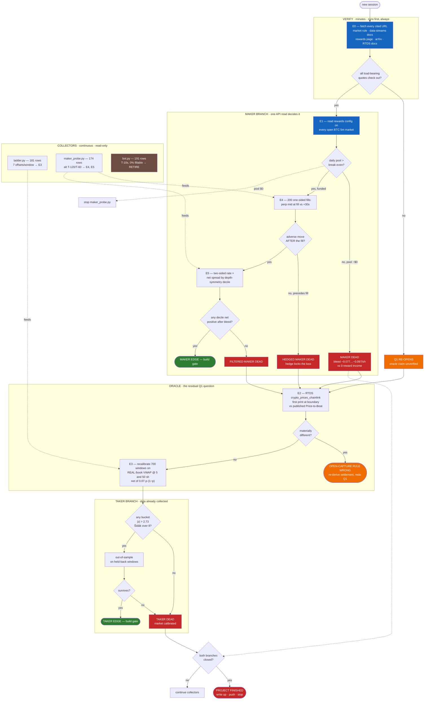

# LOOPS_V3 — Execution Graph

Supersedes [LOOPS.md](LOOPS.md). The V2 graph was four gates fed by three continuous
collectors. V3 is a **short serial chain of kill-experiments** — E0 → E1 → E2 → E3 →
E4 → E5 — because the expensive part is no longer data collection. 181 ladder rows and
174 maker rows already exist; what is missing is verification and arithmetic that takes
minutes.

Evidence behind each node: [ROADMAP_V3.md](ROADMAP_V3.md).

---

## Master graph

---

## Node table

| # | Node | Cost | Blocking | Kills | Needs |
|---|---|---|---|---|---|
| E0 | Citation verification | minutes | yes | nothing — it gates trust in E1/E2 | web fetch, ~8 URLs |
| E1 | Reward-pool read | minutes | yes | **maker branch** | CLOB API, open markets |
| E2 | Open-price capture | hours | no | re-opens Q1 if it fails | RTDS WS, ~100 windows |
| E3 | Book-VWAP recalibration | ~1 session | yes | **taker branch** | `ladder.jsonl` (181, growing) |
| E4 | One-sided-fill timing | 3–5 d | no | hedged maker | 200 one-sided fills + perp mid |
| E5 | Two-sided-fill predictability | 5–7 d | no | filtered maker | ≥500 windows |

Critical path: **E0 → E1 → E3**. Everything else is conditional. E4/E5 are unreachable
if E1 returns a $0 pool — do not run them anyway.

## Colour key

🔴 terminal death node · 🟠 re-opens a closed question · 🟢 build gate (only point at
which order-placement code is justified) · 🔵 verification · 🟤 retire

## Rejected loops — carried forward from V2, still rejected

| Loop | Why |
|---|---|
| Micro-hedge / tail bet | −14.30% ROI over 700 windows; tail priced fair, z=−0.03 |
| Ladder-gated EV snipe | 31% hit, −$0.064/trade; the EV filter selects its own worst trades |
| 0.88 price cap | Worst of four bands (−0.70% ROI) |
| Multi-RPC in trade path | CLOB orders are signed off-chain and POSTed over HTTP |
| T+30s claim loop | Settlement is ~4.6 min |
| Naive symmetric two-sided quoting | 85/85 one-sided fills on the losing side, p=3.8e-6 |
| **Settlement manipulation** | Requires capital to move BTC spot; prohibited by Polymarket's market-integrity rules; plausibly illegal. **Not a candidate at any size.** Its only role here is as a risk to a resting maker |
