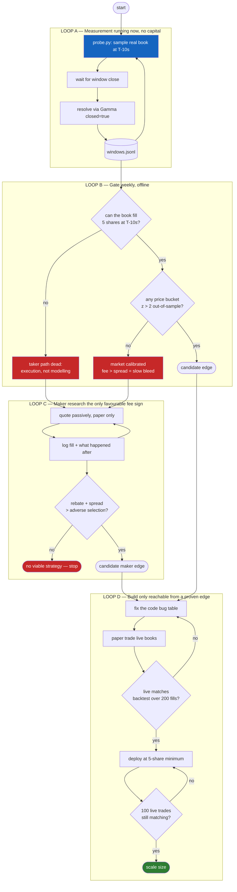

# Polymarket BTC 5-Min Bot — Findings & Roadmap

Everything below was measured against live Polymarket/Binance APIs on 2026-07-26,
over **700 consecutive real windows (~58 hours)**. Numbers are reproducible with the
scripts in this folder. Nothing here is estimated from memory.

---

## Verdict

**Do not fund the scaffold's strategy.** Simulated on its own logic against 700 real
windows it returns **−$0.064 per trade (−12.8% per $100 staked), 31% hit rate**.

Worse: at true T-10s there is nothing to buy. In 16/16 live samples the favourite had
no fillable ask at the 5-share minimum. The strategy is unexecutable before it is
unprofitable.

The market is efficiently priced, the fee is larger than the spread, the signal source
is not the source the market resolves on, and the book is empty at the moment of
execution. These are four independent failures; fixing the code bugs touches none of them.

---

## Retraction

My first draft of this roadmap claimed Polymarket slugs are "not derivable" and made
market resolution a blocker. **That was wrong.** Verified:

- `btc-updown-5m-{window_ts}` resolves correctly, where `window_ts = unix - (unix % 300)`.
- `window_ts` is the window **start**, UTC-aligned. `endDate == window_ts + 300`.
- Markets are pre-created ≥6h ahead, so prefetching works.

The scaffold's `get_slug()` is correct as written. Corrected below.

---

## Verified facts

| Fact | Value | How verified |
|---|---|---|
| Slug format | `btc-updown-5m-{window_start_ts}` | 3/3 slug queries returned the market |
| Token IDs | `market.clobTokenIds`, idx 0 = Up, idx 1 = Down | `outcomes` = `["Up","Down"]`; settle price agreed **700/700** |
| Min order size | 5 shares (`orderMinSize`) | live market object |
| Tick size | 0.01 (`orderPriceMinTickSize`) | live market object |
| Fee schedule | `{rate: 0.07, exponent: 1, takerOnly: true, rebateRate: 0.2}` | `market.feeSchedule` |
| Fee formula | `shares × 0.07 × price × (1−price)` | matches published $1.75/100sh at 50¢ |
| Resolution source | **Chainlink** BTC/USD stream | `market.resolutionSource` |
| Settled markets | require `closed=true` on the Gamma query | returns 0 rows without it |
| Settlement lag | ~4.6 min after window close | polled 10 windows by age; all closed by 4.6 min |
| `bestBid`/`bestAsk` on Gamma | **stale** | Gamma said 0.50/0.51 while the CLOB book was 0.15/0.16 |
| `prices-history` `p` | **midpoint**, not last trade | values land on half-ticks; tick is 0.01 |
| `OrderType.IOC` | **does not exist** | enum is `GTC`, `GTD`, `FOK`, `FAK` |
| `takerBaseFee: 1000` | dead legacy field | contradicts `feeSchedule.rate`; schedule is authoritative |

---

## Kill #1 — The market is calibrated

`backtest.py`, 700 windows. Buy the favourite at the last tick before T-10s, paying
mid + half-spread, net of fees.

```
ALL FAVOURITES   n=700  hit=84.4%  implied=83.7%  edge=+0.75%  z=+0.53  pnl/tr=$-0.0004
  pay 0.50-0.70  n=158  hit=60.1%  implied=59.9%  edge=+0.19%  z=+0.05  pnl/tr=$-0.0147
  pay 0.70-0.85  n=133  hit=81.2%  implied=77.5%  edge=+3.71%  z=+1.02  pnl/tr=$+0.0250
  pay 0.85-0.95  n=138  hit=89.1%  implied=89.5%  edge=-0.39%  z=-0.15  pnl/tr=$-0.0104
  pay 0.95-1.01  n=269  hit=98.1%  implied=98.0%  edge=+0.17%  z=+0.20  pnl/tr=$+0.0003
```

Every bucket is within noise (|z| < 2). The single positive bucket (z = +1.02) is what
you expect from testing four buckets. Base rate UP = 51.4%, so there is no directional drift.

**This is an upper bound on the real edge**, biased optimistic three ways:
`prices-history` granularity is ~60s so the sample is at **T-52s, not T-10s** (the market
gets 42 more seconds of information before you'd actually trade); it assumes a 1-tick
spread and full fill at the touch; it ignores latency and rejected orders.

---

## Kill #2 — The EV filter inverts the strategy

`scaffold_sim.py` runs the scaffold's *own* logic (ladder + `MIN_EV` + price cap) on the
same 700 windows, with the real market ask substituted for the hardcoded `0.80`.

```
LADDER CALIBRATION
claimed p_win  n     actual   error
0.90           46    97.8%    +7.8%
0.78           99    96.0%    +18.0%
0.65           237   86.5%    +21.5%
0.52           318   67.6%    +15.6%

TRADE GATING over 700 windows
  fired            100
  skipped low EV   600
  skipped >0.88      0

RESULT n=100 hit=31.0% pnl/trade=$-0.0641 total=$-6.41   (~-12.8% per $100 staked)
```

Read that carefully. The ladder is *conservative* — every bucket wins more often than
claimed. Yet the strategy loses badly, and the hit rate collapses to 31%, far below
every ladder bucket and below a coin flip.

**Why:** the gate `p_win − price ≥ 0.05` can only fire when the market prices the
signalled side *cheaply*. Against a calibrated market, that means it fires precisely
on the windows where the bot disagrees with a market that is right. The EV filter is
a machine for selecting the strategy's own worst trades. This is adverse selection,
and it is structural — recalibrating the ladder does not remove it, because a better
ladder converges toward the market price and simply stops trading.

---

## Kill #3 — Wrong price feed

The bot signals on Binance BTCUSDT. The market resolves on Chainlink BTC/USD.

`basis.py`, same 700 windows:

```
Binance 5m candle sign vs resolved outcome: 663/700 = 94.71%
disagreements: 35    (35/35 were under 2bps of movement)
```

Binance disagrees with the resolution on **5.3% of windows**, and 100% of those
disagreements sit under 2bps of price movement.

The scaffold's `|delta| >= 0.02` threshold is 0.02% = **2bps**. So its largest bucket
(`p_win = 0.52`, 318 of 700 windows) lies *entirely inside the zone where Binance is
not a reliable proxy for the resolution source*. The bot is least informed exactly
where it trades most.

---

## Kill #4 — You cannot fill at T-10s (this is the decisive one)

`probe.py` samples the real book at true T-10s. First 16 windows:

```
btc-updown-5m-1785099300 delta=+0.02002 leader=UP   up_ask=None  down_ask=0.01
btc-updown-5m-1785099600 delta=+0.05100 leader=UP   up_ask=None  down_ask=0.001
btc-updown-5m-1785099900 delta=-0.03095 leader=DOWN up_ask=0.001 down_ask=None
btc-updown-5m-1785100800 delta=+0.10549 leader=UP   up_ask=None  down_ask=0.01
btc-updown-5m-1785102900 delta=+0.32529 leader=UP   up_ask=0.01  down_ask=None
...
```

**In 16 of 16 windows, exactly one side had no fillable ask for even the 5-share
minimum, and the other side was quoted at $0.001–$0.01.**

By T-10s the book has collapsed to: nobody offers the favourite at any size, and the
loser is a penny lottery ticket. There is no favourite to snipe. The scaffold's entire
premise — cross the spread on the favourite in the last 10 seconds — is not merely
unprofitable, it is **unexecutable**.

This supersedes Kills #1–#3. Those say the trade has no edge; this says the trade
does not exist.

Binance's T-10s leader matched the outcome 14/16, so the *signal* is roughly fine.
There is simply nothing to buy.

---

## Code bugs (real, but not why it loses)

Fixing all of these gets you a bot that loses money correctly.

| File | Bug | Fix |
|---|---|---|
| `clob_execution.py` | `OrderType.IOC` → `AttributeError` on first live order | use `FAK` |
| `main.py` | `token_id = "MOCK_TOKEN_ID_UP"` — can never fill | `json.loads(market["clobTokenIds"])[0 if UP else 1]` |
| `main.py` | `target_price = 0.80` hardcoded | read `/book`, VWAP the asks for your size |
| `main.py` | `open_price = klines[-5]` is the 5th-last 1m close | 1m kline with `openTime == window_ts` |
| `main.py` | EV ignores fees | `ev = p_win − price − 0.07·price·(1−price)` |
| `main.py` | `shares = max(MIN_SHARES, stake/price)` overrides Kelly=0 — trades while the circuit breaker says stop | gate on `stake > 0` first |
| `main.py` | no `shares × price ≤ bankroll` check | add it |
| `clob_execution.py` | prices not rounded to the 0.01 tick | `round(price, 2)` |
| `strategy.py` | `calculate_atr` = `np.std(closes)`, not ATR | true range over high/low/close |
| `risk_manager.py` | breaker latches forever; bankroll hardcoded `200.0` | daily reset; read on-chain balance |
| Gamma queries | settled markets invisible | pass `closed=true` |
| `run.sh` | wrong script name; POSIX `source`/`cp` on Windows | `venv\Scripts\activate`, `copy` |

---

## What is actually worth building

The fee structure is the one genuine asymmetry found, and it points the opposite way
from the scaffold:

- Takers pay `0.07·p·(1−p)`. At p=0.50 that is **$0.0175/share against a $0.01 spread —
  the fee is 1.75× the entire spread.**
- Makers pay **nothing** and receive a **20% rebate** of taker fees.

A taker strategy on this market must overcome a cost larger than the spread it is
trying to capture. A maker strategy is paid to be there. That does **not** mean market
making works here — resting quotes on a 5-minute binary get filled by informed flow
right before resolution, and that adverse selection is unmeasured. It means it is the
only direction whose fee sign is not fatal before you start.

**Recommended sequence:**

1. **Keep `probe.py` running for ~1 week** (~2000 windows). It costs nothing and gives
   the one thing no dataset has: real ask prices and depth at true T-10s.
2. **Answer the fill question first.** If the favourite's book cannot absorb 5 shares
   at T-10s, every taker variant is dead on execution grounds and no further modelling
   is needed.
3. **Only if a bucket shows z > 2 on out-of-sample data**, revisit taking.
4. **Otherwise pivot to the maker side** and measure the actual quantity that matters:
   fill-to-adverse-selection ratio on resting quotes. Build that as a second probe,
   not as a trading bot.
5. **Do not deploy capital** until a measured edge survives fees, spread, and the
   T-52s → T-10s information gap.

---

## Loop graph



The scaffold's design starts at Loop D. Loops A and B are what decide whether Loop D
should exist, and on current evidence it should not.

---

## Files

| File | Purpose |
|---|---|
| `probe.py` | Live sampler — real book at true T-10s + resolution. Running. |
| `backtest.py` | 700-window reconstruction + calibration z-scores. Caches to `windows_hist.jsonl`. |
| `scaffold_sim.py` | Runs the scaffold's own strategy against those 700 windows. |
| `basis.py` | Binance vs Chainlink resolution agreement. |

Reproduce: `python backtest.py 700` → `python scaffold_sim.py` → `python basis.py`.
